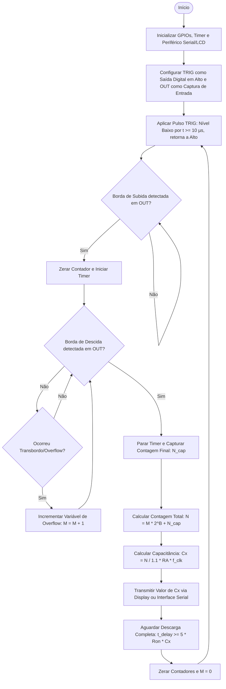

Representação estruturada em linguagem Mermaid do fluxograma lógico do *firmware* para o capacimetro:

```mermaid
flowchart TD
    Start([Início]) --> Init[Inicializar GPIOs, Timer e Periférico Serial/LCD]
    Init --> Config[Configurar TRIG como Saída Digital em Alto e OUT como Captura de Entrada]
    Config --> Trigger[Aplicar Pulso TRIG: Nível Baixo por t >= 10 µs, retorna a Alto]
    Trigger --> DetectRise{Borda de Subida detectada em OUT?}
    DetectRise -- Não --> DetectRise
    DetectRise -- Sim --> StartTimer[Zerar Contador e Iniciar Timer]
    StartTimer --> DetectFall{Borda de Descida detectada em OUT?}
    DetectFall -- Não --> CheckOverflow{Ocorreu Transbordo/Overflow?}
    CheckOverflow -- Sim --> IncOF[Incrementar Variável de Overflow: M = M + 1]
    IncOF --> DetectFall
    CheckOverflow -- Não --> DetectFall
    DetectFall -- Sim --> StopTimer[Parar Timer e Capturar Contagem Final: N_cap]
    StopTimer --> CalcTicks[Calcular Contagem Total: N = M * 2^B + N_cap]
    CalcTicks --> CalcCap[Calcular Capacitância: Cx = N / 1.1 * RA * f_clk]
    CalcCap --> Display[Transmitir Valor de Cx via Display ou Interface Serial]
    Display --> Delay[Aguardar Descarga Completa: t_delay >= 5 * Ron * Cx]
    Delay --> ResetVar[Zerar Contadores e M = 0]
    ResetVar --> Trigger

```